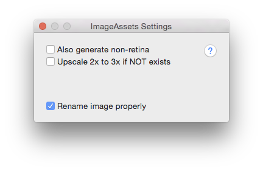

RTImageAssets  
=============

简介
---
本项目是一个 **Xcode** 插件，用来生成 @3x 的图片资源对应的 @2x 和 @1x 版本，只要拖拽高清图到 @3x 的位置上，然后按 `Ctrl+Shift+A` 即可自动生成两张低清的补全空位。当然你也可以从 @2x 的图生成 @3x 版本，如果你对图片质量要求不高的话。

特性
---
- 只会填补空位，如果你已经设置好了自己的 @2x 图，则不会生成；
- 自动重命名，保持项目干净（把 N.imageset 下的图片名字改为 `N.png` `N@2x.png` `N@3x.png` 等）；
- 使用简单，不用再麻烦美术同学缩放了；

    ***注意：***本插件从 @3x 到 @2x 的缩放保证图片在屏幕上显示的物理尺寸一样，而不是与屏幕比例一样，缩放系数是 **1.5**，而不是 `1242 / 640 = 1.94`。

设置
---

安装
---
下载本项目，在 `Xcode` 中打开，构建、重启即可。

问题
---
此插件还没有经过严格测试，如果你有什么问题，请提出：<https://github.com/rickytan/RTImageAssets/issues>

协议
---
**MIT**

Brief
---
A Xcode plugin to automatically generate @2x, @1x image from @3x image for you, or upscale to @3x from @2x. As easy as you press `Ctrl+Shift+A`, and **DONE**!

Features
---
- Only generate those missing assets, if you have already set your own @2x image, it does nothing
- Automaticaly rename those image files under `N.imageset` to `N.png`, `N@2x.png`, `N@3x.png`
- Easy to use, don't need ask for your designer's help any more!

Settings
---

Install
---
Clone this Repo, build it in `Xcode`, and restart your `Xcode`.

Issues
---
This plugin is **NOT** fully tested, if you have any problems, please let me know: <https://github.com/rickytan/RTImageAssets/issues>

License
---
**MIT**
